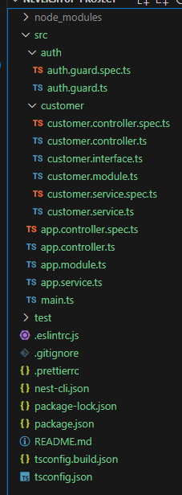
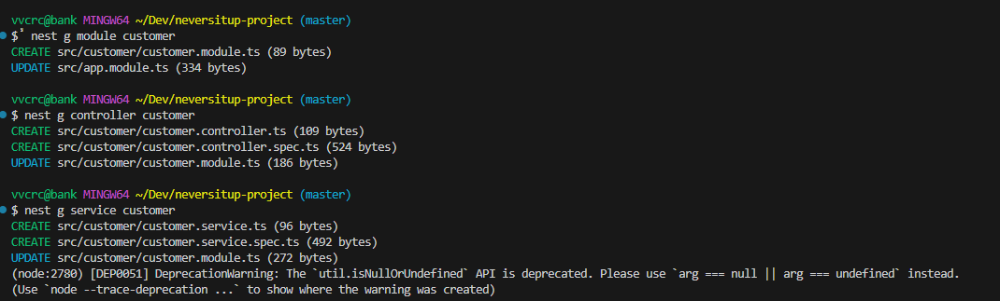
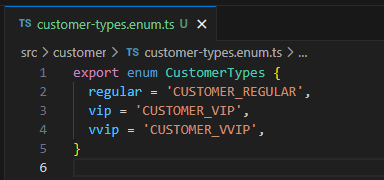

# Init project structure based on [NestJS](https://nestjs.com/)

## Convention

- Elements should be generated by the CLI to follow best practices and ensure consistency, as shown in the figure below.
  
- Variable should be readable and meaningful ex. **customer** rather than **c**.
- Avoid hard-code, eg., using enum or config instead.
  
- Follow api naming conventions guidelines, e.g.,
  - /customers
  - /customers/{id}
  - /customers/{id}/accounts
- Use proper HTTP request method.
- Use git.
- Git commit message should be readable, meaningful and follow conventional commit guidelines, e.g., `feat: send confirmation email to customer after making a purchase`.
- master branch should be always work on production, should checkout feature branch from develop branch while in development process.
